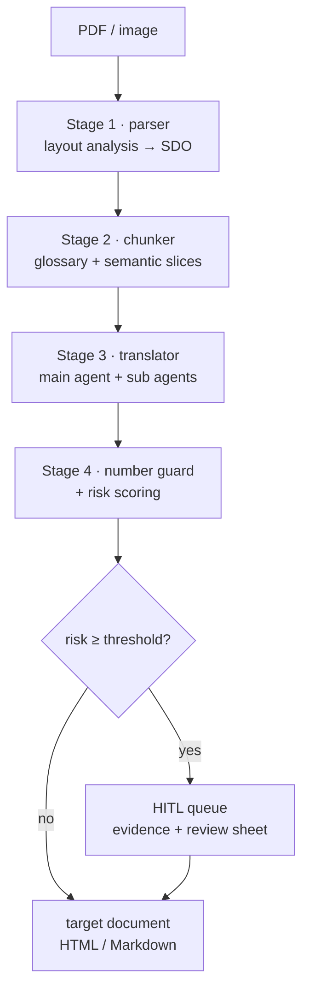

# annual-report-translator

[简体中文](README.zh-CN.md) | **English**

A multi-agent pipeline that translates layout-heavy annual reports — statements,
notes, charts and prose — into a target-language document, **with the parts that
usually go wrong made mechanically checkable**.

The design premise is narrow and deliberate: an LLM cannot be trusted to reproduce
a financial figure, so the pipeline is built so that it never gets the chance. The
model translates *labels and prose*; every number is copied by code from the source
document and compared against the source afterwards by a deterministic guard. If a
figure moves, the chunk goes to a human queue with the evidence attached.

This repository is the implementation, not a proposal. Everything below is
runnable from a fresh clone with **no install step and no credentials**.

---

## 1. Thirty-second proof

Get it running, then run everything:

```bash
git clone <this-repo> && cd annual-report-translator

# Run straight from the clone: no install, no API key, no third-party package.
PYTHONPATH=src python -m art.cli demo          # Linux / macOS / Git Bash
set PYTHONPATH=src && python -m art.cli demo   # Windows cmd
$env:PYTHONPATH="src"; python -m art.cli demo  # PowerShell

# The suite needs nothing at all -- pytest reads src/ from pyproject.toml.
python -m pytest
```

Or install the package to get the `art` command. It declares **zero runtime
dependencies**, so this installs nothing but the project itself:

```bash
pip install -e .
art demo
```

`art demo` ends with the line that matters:

```
  VERDICT: guard caught 2 of 2 injected corruption(s)
```

(The demo defaults to `--fault 2`; the flag is what sets the number.)

The `--fault N` flag does not *simulate* a report of an error. It reaches into the
mock model and corrupts exactly `N` figures in the translated output. The number
guard then has to find all `N` of them. If the guard regresses, this line and the
corresponding tests fail — which is the difference between "we validate the
numbers" and a claim anyone can check.

```bash
art demo --fault 0    # clean run: must flag nothing
art demo --fault 5    # harder: must still catch 5 of 5
```

---

## 2. The problem this solves

A bank's annual report is not prose with numbers in it. It is a layout artifact:

- **Tables carry the meaning through position.** A figure is only interpretable
  next to its row label *and* its column header, and those headers are frequently
  merged across cells. Losing a merged cell silently changes what a number means.
- **Numbers are load-bearing and legally exposed.** `1,234,567` becoming
  `1,934,567` is a 57% error that no readability check will catch, and a
  translation vendor is contractually liable for it.
- **Terminology must be consistent across the whole document.** "Revenue" cannot be
  *营业收入* in the statement and *收入* in the MD&A. A chunk-local translation
  pipeline produces exactly that inconsistency.
- **The failure mode of an LLM here is fluent, confident and wrong.** A model that
  invents a plausible number produces output that looks perfect and is unusable.

Generic "translate this PDF" tooling fails on all four, and fails quietly.

---

## 3. Architecture

Four stages over one shared contract, plus a cross-cutting human-in-the-loop layer.



| Stage | Module | Produces |
|---|---|---|
| 1 | `parser/` | `StructuredDocument` — typed pages of text / table / chart / image blocks |
| 2 | `chunker/` | glossary + chunks that never split a table |
| 3 | `translator/` | per-chunk translation, numbers copied by code |
| 4 | `translator/number_guard.py` + `hitl/` | number findings, risk score, review queue |

### The one contract: the Structured Document Object

Every stage speaks the same typed object (`art.schema`). A page is a list of
`TextBlock | TableBlock | ChartBlock | ImageBlock`; a `TableBlock` is a `TableGrid`
of `TableCell`s with explicit `row_span` / `col_span` and a `covered_slots` set.
Navigation is by `bbox`, so any finding can be traced back to a rectangle on a page.

This is what makes the pipeline auditable rather than merely plausible: a number
finding is not a sentence in a log, it is a typed record pointing at
`(page, block, row, col)` in a structure both the parser and the reviewer read.

### Why the model never sees a number

Sub-agent responsibilities are split by *what can be verified*, not by topic:

- **Label cells and prose** → sent to the model. These are translatable and their
  correctness is a matter of judgement.
- **Numeric cells** → never sent. Positional values are collected into a payload
  keyed by `(row, col)`, and the translated grid is rebuilt by copying them through.

So the numeric columns of a translated statement are not "checked"; they are
**incapable of being wrong**, because no model output ever contains them. The guard
then covers the remaining, more interesting surface: figures embedded in prose and
chart descriptions, where a number genuinely is inside a sentence the model rewrote.

This property is asserted directly, not assumed — see
`tests/test_e2e.py::test_numbers_are_kept_away_from_the_model`, which plants a
unique sentinel figure in the source and fails if it appears in *any* prompt.

---

## 4. Verification matrix

Six required capabilities, each with the command that demonstrates it and
the tests that hold it in place. Run any row yourself; nothing here needs a network.

| # | Requirement | See it with | Held by |
|---|---|---|---|
| 1 | PDF/image → structured **HTML + JSON** | `art demo` · `art parse --json` | `test_e2e.py` (29), `test_schema.py` (27) |
| 2 | Table cell **alignment + merged cells** | `art parse --tables` · `art inspect` | `test_table_builder.py` (24) |
| 3 | **Whole-document terminology** consistency | `art chunk` (glossary + authority) | `test_glossary.py` (36), `test_chunker.py` (41) |
| 4 | **Numeric-hallucination detection** | `art translate --inject-fault N` | `test_number_guard.py` (45), `test_mock_llm.py` (28) |
| 5 | **Configurable HITL threshold** | `art translate --threshold 0.3` | `test_hitl.py` (53) |
| 6 | **CLI + Web demo** | `art demo` · `art web` · `art review` | `test_cli.py` (11), `test_web.py` (26), `test_demo.py` (20) |

**340 tests, standard library only, ~4 s.** No fixtures to download, no API keys, no
mocking framework — the pipeline's own `mock` backend is the test double, and it is
the same code path the demo uses, so the demo cannot drift away from what is tested.

---

## 5. The number guard

The core invariant. `art/translator/number_guard.py`, `translator/llm.py`.

**Extraction and normalisation.** Figures are pulled out of both source and target
and normalised before comparison, because the same amount is written differently in
the two languages:

- unit scale words — `千元` / `百万` / `万` / `亿` / `'000` — resolve to an absolute value;
- full-width digits and punctuation are folded to ASCII;
- Chinese numerals (`一千二百三十四`, `三千万`) convert to integers;
- parenthesised negatives `(1,234)` are losses, not positive numbers;
- a table's `单位：人民币千元` note is inherited by every cell in that table.

**Comparison is deliberately two-tiered.**

1. **Unit-aware equality** catches order-of-magnitude and sign errors outright.
2. **Near-miss detection by digit edit distance ≤ 2** catches the error a naive guard
   misses: `1,234,567 → 1,934,567` is one digit, and a 57% change in value. Exact
   matching would pass it. A digit-slip typo is the realistic hallucination, so the
   guard is built for typos, not just for blow-ups.

Structural failures are reported separately from value failures: a unit note that
disappears, or a table that no longer sits inside its chunk's position map, is a
structural finding even when every remaining figure happens to match.

### The injector is on the guard's side

For "caught N of N" to mean anything, the injector and the guard must agree on what
counts as a *figure*. `MockLLM._corrupt_numbers` therefore asks the guard which
spans are trackable (`extract_numbers`) and excludes date-like tokens
(`looks_like_a_date`) and scale markers such as `RMB'000`.

Without that discipline the harness lies to itself in both directions: corrupting a
date turns a real finding into a benign "added figure", and the guard is blamed for
a miss it never had a chance to make. `test_mock_llm.py` pins this down — including
that the injector leaves a date and a `RMB'000` marker alone.

---

## 6. Tables: geometry in, merged cells out

`art/parser/table_builder.py`. A VLM returns cell boxes, not a grid. The builder
infers the grid by clustering the boxes' edges.

The detail that matters: **the tolerance is scaled to the narrowest cell dimension,
not to the median gap between edges.** A VLM's boxes jitter by a few pixels, and a
tolerance derived from edge spacing shatters on a table with narrow columns. Scaling
to the cell absorbs the jitter deterministically — same input, same grid, no
tuning per document.

Merged cells are recovered as spans, and where a hint from the model contradicts the
geometry, **the geometry wins**. When the two cannot be reconciled the builder emits
a *degraded* table plus a warning rather than a plausible-looking guess. A table that
is visibly wrong is recoverable by a human; a table that is quietly wrong is not.

The proof that layout survives the pipeline is a round-trip:

```
RawCell boxes → TableGrid (spans) → HTML → TableGrid again
```

`table_to_html` / `table_from_html` must return the same grid, including the holes —
slots no box covers, emitted as `data-empty="1"` and skipped on re-read so a missing
cell never resurrects itself as a blank one. This is `test_table_builder.py`'s
round-trip group and `test_e2e.py`'s layout-survival group.

---

## 7. Terminology consistency

`art/chunker/glossary.py`. Consistency is a *document-level* property, so the
glossary is built before chunking and attached to every chunk — the same terms reach
the first page and the last.

Extraction pulls candidate pairs from three sources, including **issuer-supplied
bilingual parentheticals** (`Total assets (资产总额)`). Those are gold: the client has
already told us the approved rendering, so they are harvested at the highest authority.

Every entry carries an authority rank, because "which translation wins" must have a
written answer:

```
source_gloss (issuer)  >  curated (hand-edited)  >  seed (built-in)  >  model
```

Two consequences the tests enforce: a model suggestion can never override a seed
entry, and a *hand-edited* glossary file changes the next run — the artefact is the
input to the pipeline, not a report about it.

Unresolved terms are not swallowed. They are counted per chunk and feed the risk
score, so a chunk full of untranslated jargon surfaces for review instead of
producing confident nonsense.

---

## 8. Human-in-the-loop

`art/hitl/`. Requirement 5 asks for a *configurable* threshold, which only means
something if the score beneath it is explainable.

**Risk is computed from measured artefacts only.** `RiskFeatures` is populated from
the guard's output and the validator's findings — never from a model's self-reported
confidence, which is exactly the signal that is unavailable when the model is wrong.
Weights are explicit, and they are *ranked* rather than arbitrary. Counts are
normalised against a saturation point per feature (`number_mismatch` 2, `grid_hole`
4, `unknown_terms` 15), so one hole is not treated as four times as alarming as four:

| Feature | Weight | Why |
|---|---|---|
| `number_drift` | 1.00 | Share of source figures that failed to match — the direct measure of damage |
| `error` | 1.00 | A chunk the backend failed to translate is a hard finding |
| `number_mismatch` | 0.55 | Figures that changed value |
| `chart_unresolved` | 0.55 | A chart whose series could not be read |
| `grid_hole` | 0.45 | A slot no cell covers — the table lost a cell |
| `merge_conflict` | 0.40 | The model's merge hint contradicted the geometry |
| `terminology_remaining` | 0.40 | Terms still untranslated after the repair pass |
| `numeric_density` | 0.35 | How much of the chunk is figures |
| `number_structural` | 0.30 | e.g. a unit note that vanished from the target |
| `untranslated_labels` | 0.30 | Table labels the model did not translate |
| `unknown_terms` | 0.30 | Terms with no approved rendering |
| `number_added` | 0.25 | **Deliberately below a mismatch** — see below |
| `table_warning` | 0.20 | A degraded table read |

`number_added` is weighted low on purpose. A benign date reformat such as
`31 December 2023 → 截至2023年12月31日止年度` *adds* a figure, and a weight that
treated fabrication and reformatting alike would flag every well-translated
document — after which reviewers stop reading the queue, which is worse than having
no queue. It is half a mismatch: real, but it must accumulate before anyone is asked
to look.

The threshold is a CLI flag and an env var (`--threshold` /
`ART_HITL_THRESHOLD`), and it behaves as a real policy dial: `tests/test_hitl.py`
asserts that a financial threshold flags a chunk that a plain threshold passes, and
that the value is floored so a misconfigured `0` cannot silently disable review.

**The queue is a file, not a screen.** `review.jsonl` holds one JSON object per item,
each self-contained (source text, target text, every finding, the evidence, the risk
breakdown), and reviewer decisions are persisted back as
`pending / approved / rejected / skipped`. Reviewer-facing exports are generated in
Markdown, HTML, CSV and JSONL so the work can be handed to a translator who has
never seen this repo — which is the actual deployment constraint.

**An item's identity is derived from its chunk, not generated.** This looks like a
detail and is not one. Run directories get reused, and the module exists so the
queue can be diffed: *last week's model left 12 items, this week's leaves 3*. A
random id per item destroys exactly that — every re-run appends near-duplicates, the
diff becomes noise, and a decision recorded last week can never be reached again.
Because `item_id` is a function of `chunk_id`, re-running refreshes the entry the
reviewer already saw.

The subtler half is what a decision *covers*. An approval is of one specific
output, not of a chunk forever, so the decision is carried across a re-run only
while the evidence is unchanged; if the target text or the risk moved, the item
reopens as `pending` and the prior decision is kept as an audit note. Silently
retaining an approval for output that has been replaced would be the one outcome
worse than losing it. `tests/test_hitl.py::TestRerunningIntoTheSameQueue` and
`tests/test_cli.py::TestReviewDecisions` hold both halves in place.

---

## 9. Backends and configuration

Core is stdlib-only. Real backends are optional extras behind lazy imports, so
`import art` never fails on a bare interpreter.

```bash
pip install -e ".[llm]"         # real model (OpenAI-compatible endpoint)
pip install -e ".[pdf]"         # PDF rasterisation (PyMuPDF)
pip install -e ".[ocr]"         # local OCR / layout fallback (PaddleOCR)
pip install -e ".[web]"         # browser demo (FastAPI + uvicorn)
pip install -e ".[all,dev]"     # everything + test tooling
```

```bash
art parse     report.pdf --tables        # structure only
art chunk     report.pdf --glossary g.json
art translate report.pdf --out runs/live # full run → artefacts + review queue
art translate report.pdf --preview-tables # show each table as the pipeline rebuilt it
art review    runs/live/review.jsonl --export runs/live/sheet
art inspect   report.pdf --outline
art demo                                 # offline, no credentials
art web                                  # browser demo, runs offline
```

Pointing it at a real model is configuration, not a code change — the pipeline is
written against an `LLMClient` protocol, and the offline `mock` backend implements
the same protocol. Copy `.env.example` to `.env` for a DashScope / Qwen endpoint:

```bash
ART_LLM_BASE_URL=https://dashscope.aliyuncs.com/compatible-mode/v1
ART_LLM_API_KEY=sk-...
ART_LLM_MODEL=qwen-plus          # text
ART_VLM_MODEL=qwen2.5-vl-72b-instruct   # layout + charts
ART_PARSER_BACKEND=qwen-vl
ART_HITL_THRESHOLD=0.45
```

`--llm auto` selects the real backend when credentials are present and falls back to
`mock`, but an explicitly requested real backend with no key is a hard error rather
than a silent downgrade — a translation run that quietly produced mock output would
be worse than a failed one.

### Web demo

`art web` serves a single self-contained page (no CDN, no build step) that runs the
same `art.demo` service the CLI uses. Because both front ends share that module,
the demo cannot drift away from what the tests exercise.

It exposes a **live audit** of the central claim: for the run it just performed, the
number of label cells sent to the model, the number of numeric cells copied by code,
and a check that no numeric cell's text appears in any rendered table payload. That
is the "numbers never reach the model" property, shown on screen rather than asserted
in a comment.

The demo binds to `127.0.0.1` by default, and fixture names are resolved against
`examples/` with the resolved path checked to be inside that directory, so a crafted
`../../etc/passwd`-style name is rejected before it reaches the filesystem.

---

## 10. Repository layout

```
src/art/
  schema.py            SDO: the typed contract every stage speaks
  textutils.py         CJK-aware normalisation and label/numeric predicates
  demo.py              shared offline demo service (CLI + web)
  cli.py               the `art` command
  parser/              stage 1  layout analysis → SDO
    pipeline.py          DocumentParser orchestration
    table_builder.py     geometry → grid, HTML round-trip, tsv/markdown/records
    chart_reader.py      chart crop → data points
    mock_analyzer.py     deterministic offline analyser + demo page
    qwen_vl_analyzer.py  Qwen-VL backend
    paddle_analyzer.py   PaddleOCR backend
    pdf_loader.py        PDF rasterisation
  chunker/             stage 2  semantic slicing + glossary
    headings.py          heading detection (cn/en, numbering, font fallback)
    chunker.py           block → chunk assignment, table atomicity
    glossary.py          extraction, authority ranking, bilingual pairs
    pipeline.py          ChunkingPipeline
    retriever.py         glossary retrieval for prompt building
  translator/          stage 3  main agent + sub agents
    llm.py               LLMClient protocol, MockLLM (fault injector), OpenAI-compatible client
    agents.py            agent roles and prompt assembly
    number_guard.py      extraction, normalisation, comparison
    pipeline.py          TranslationPipeline + report renderers
  hitl/                cross-cutting
    policy.py            RiskFeatures, RiskPolicy, weighted scoring
    queue.py             ReviewQueue / ReviewItem (JSONL-backed)
    exporters.py         Markdown / HTML / CSV / JSONL reviewer bundle
  web/
    app.py               FastAPI app factory, endpoints, fixture resolution
    page.py              single self-contained front-end page
    render.py            source/target HTML + the live number-leak audit
tests/                 340 tests, stdlib only
  test_cli.py            the command's own logic: flags, id resolution, exit codes
examples/
  demo_annual_report.json   recorded layout for offline replay
  run_sample/               committed artefacts from a real run
```

---

## 11. Design decisions worth arguing about

**Deterministic over probabilistic where it matters.** Numbers, table geometry and
terminology authority are all handled by ordinary code. The model is given the part
of the problem where judgement is genuinely required. Every place a model *could*
have been used and was not is a place that cannot hallucinate.

**Confidence scores are not features.** Risk is computed from what was measured, not
from what the model says about itself. A model's self-reported confidence is least
reliable precisely when it is most needed.

**Fail loudly, degrade visibly.** An oversized table gets its own chunk rather than a
silent split; an irreconcilable merge becomes a warning and a degraded flag; an
unresolved term is counted and scored. The pipeline is designed to have visible edges.

**`mock` is a first-class backend, not a stub.** It is deterministic, it is what the
tests and the demo both run on, and it carries a fault injector. A backend that only
exists to make tests pass would not be worth this much attention; one that can be
*told to be wrong* is the mechanism that turns a validation claim into a check.

**Stdlib-only core.** A reviewer can clone and run without installing anything. That
constraint is uncomfortable in places, and it is the reason the verification story is
credible on the first command.

### What the verification loop actually caught

The point of building the checks first is that they find things. These are real
defects this repo's own tests, lint pass and demo surfaced — listed because "we
validate carefully" is a claim, and a list of bugs the validation caught is evidence:

| Defect | How it surfaced | Why it mattered |
|---|---|---|
| `MockLLM.__init__` never set its fault budget | AttributeError on every prose call | The injector could not run at all |
| The injector corrupted dates and scale markers | "caught 1 of 3" on the built-in page | Made "N of N" unfalsifiable — a miss the guard never had a chance to make |
| `looks_numeric("(456,789)")` returned False | A test written against loss-format rows | A loss row was classified as a table header, corrupting every figure beneath it |
| `ReviewItem` minted a random id per item | Re-running the demo duplicated the queue | Destroyed the diffable queue the module exists to provide, and orphaned decisions |
| `--inject-fault` set an attribute `__init__` had snapshotted | The flag reported success and injected nothing | A flag that lies is worse than a missing one |
| `art review --approve` demanded an id the listing never printed | Walking the documented workflow | The reviewer's primary interface could not be used as documented |
| An unknown review id raised `KeyError` | A typo in a batch | A traceback instead of an error message and a non-zero exit |
| `table_preview` called an unimported name | A lint pass removed a redundant import | A latent `NameError` on a code path no test reached |
| `pyproject` omitted `httpx` for `TestClient` | Reasoning about a clean install | The web tests would have errored rather than skipped in a fresh environment |
| Whitespace collapse left triple spaces | Round-trip test | `"a   b"` reached the glossary and the guards |

Every behavioural one of these is now pinned by a test, so it cannot come back
silently. Finding them is also the argument for the fault injector and for the
adversarial style of the suite: none of these were visible from the outside.

---

## 12. Status and limitations

- **Backends for real documents are implemented but not exercised against a
  production corpus.** `qwen-vl`, `paddle` and PDF rasterisation are wired and
  lazily imported; the tested, reproducible path is the offline one.
- **Chart reading covers labelled cartesian charts.** Pie charts and unlabelled
  series are detected and reported as unresolved rather than guessed at — an
  unresolved chart is a review item, not a silent omission.
- **Bilingual pair harvesting over-captures leftward on mid-sentence glosses.** A
  parenthetical in the middle of a sentence can drag in the preceding conjunction.
  This is acceptable because harvested entries are *candidates* at the highest
  authority rank and are corrected in the glossary file — but it is a known rough
  edge, documented at the call site.
- **Chinese↔English is the developed pair.** The CJK handling is real work; the code
  is structured for other pairs but they are untested.

## 13. Development

```bash
pip install -e ".[dev]"     # pytest, pytest-cov, ruff, httpx (for TestClient)
python -m pytest            # 340 tests, ~4 s (network-marked tests deselected)
python -m pytest -m network # opt in: only tests needing a real API + credentials
ruff check src tests        # line-length 100, E/F/I/UP/B/SIM/C4/PTH
```

Tests import `art` via pytest's `pythonpath` setting, so no `pip install` is
needed to test — the project's own "clone and run" property is the thing being
preserved, and CI asserts it.

CI (`.github/workflows/ci.yml`) is built to fail loudly rather than to look green:

- **`core`** installs *only* `pytest`, asserts that none of the optional backends
  are importable (so the job is genuinely the dependency-free path rather than
  quietly relying on something), then runs the suite and the guard assertions for
  several fault levels plus a clean run.
- **`extras`** installs `.[web,dev]`, runs the suite with the web tests *executing*,
  and fails if they silently skipped — a green job covering nothing is the failure
  this is guarding against. It then drives the real server over HTTP and checks the
  demo's own JSON verdict and the path-traversal rejection.
- **`lint`** runs `ruff`, and is `continue-on-error` so style can never mask a
  correctness signal.

## License

MIT — see `LICENSE`.
