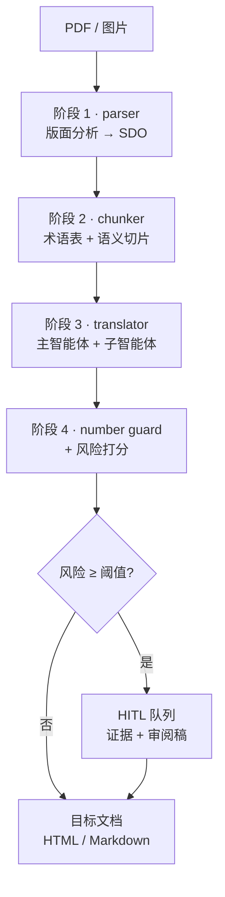

# annual-report-translator

**简体中文** | [English](README.md)

一条多智能体流水线，把以版面承载信息的年报——报表、附注、图表与正文——翻译成目标语言文档，并且**把那些通常出问题的地方，做成可以被机械核查的**。

设计前提很窄，但是刻意的：**不能指望 LLM 复现一个财务数字，所以这条流水线就让它根本没机会碰到数字。** 模型翻译*标签和正文*；每一个数字都由代码从源文档复制过来，事后再由一个确定性守卫回头比对源文档。只要有数字动了，这个块就连同证据一起进入人工复核队列。

这是一个**可运行的实现**。下面所有内容都能从一个全新克隆开始跑起来，**不需要安装步骤，也不需要任何凭证**。

---

## 1. 三十秒证明

先跑起来，然后跑通全部：

```bash
git clone <this-repo> && cd annual-report-translator

# 直接从克隆跑：不装包、不用 API key、不依赖任何第三方包。
PYTHONPATH=src python -m art.cli demo          # Linux / macOS / Git Bash
set PYTHONPATH=src && python -m art.cli demo   # Windows cmd
$env:PYTHONPATH="src"; python -m art.cli demo  # PowerShell

# 测试套件什么都不需要——pytest 会从 pyproject.toml 里读到 src/。
python -m pytest
```

或者安装成包，拿到 `art` 命令。它声明了**零运行时依赖**，所以这一步除了项目自己什么都不装：

```bash
pip install -e .
art demo
```

`art demo` 结尾会打印那行最关键的：

```
  VERDICT: guard caught 2 of 2 injected corruption(s)
```

（demo 默认 `--fault 2`；这个标志就是用来设定数字的。）

`--fault N` **不是**在*模拟*一份"报错报告"。它会真的伸进 mock 模型，在译文里精确篡改恰好 `N` 个数字。然后数字守卫必须把这 `N` 个全部找出来。如果守卫退化了，这一行和对应的测试就会失败——这就是"我们校验数字"和"任何人都能查证的声明"之间的区别。

```bash
art demo --fault 0    # 干净运行：必须一个都不报
art demo --fault 5    # 加压：仍然必须 5 个抓 5 个
```

---

## 2. 这个项目解决什么问题

银行的年报不是"带数字的散文"，它是一个版面产物：

- **表格靠位置承载含义。** 一个数字只有跟它的行标签*和*列标题放在一起才可解读，而这些标题经常跨单元格合并。丢一个合并单元格，会悄无声息地改变一个数字的含义。
- **数字是承重的，而且有法律暴露面。** `1,234,567` 变成 `1,934,567` 是 57% 的错误，任何可读性检查都抓不到，而翻译供应商对此是有合同责任的。
- **术语必须在全篇一致。** "Revenue" 不能在报表里是*营业收入*、在管理层讨论里是*收入*。按块翻译的流水线恰好会产出这种不一致。
- **模型在这里的失败模式是：流畅、自信、且错。** 一个编造出看似合理数字的模型，会产出看起来完美、实际不可用的结果。

通用的"翻译这个 PDF"工具在这四点上都失败，而且是**安静地**失败。

---

## 3. 架构

一个共享契约之上的四个阶段，外加一层横切的人在回路。



| 阶段 | 模块 | 产出 |
|---|---|---|
| 1 | `parser/` | `StructuredDocument` —— 由 text / table / chart / image 块组成的、带类型的页面 |
| 2 | `chunker/` | 术语表 + 绝不切开表格的分块 |
| 3 | `translator/` | 逐块翻译，数字由代码复制 |
| 4 | `translator/number_guard.py` + `hitl/` | 数字发现、风险分、复核队列 |

### 唯一的契约：结构化文档对象（SDO）

每个阶段都讲同一种带类型的对象（`art.schema`）。一页是 `TextBlock | TableBlock | ChartBlock | ImageBlock` 的列表；一个 `TableBlock` 是由 `TableCell` 组成的 `TableGrid`，带显式的 `row_span` / `col_span` 和一个 `covered_slots` 集合。导航靠 `bbox`，所以任何一条发现都能被追溯到页面上的一个矩形。

这就是让流水线**可审计、而不只是看起来合理**的原因：一条数字发现不是日志里的一句话，而是一条带类型的记录，指向结构里的 `(page, block, row, col)`——解析器和复核人读的是同一个结构。

### 为什么模型永远看不到一个数字

子智能体的职责是按"什么是可验证的"来划分的，不是按主题：

- **标签单元格和正文** → 发给模型。它们是可翻译的，而且对错属于判断范畴。
- **数字单元格** → 永不发送。位置值被收集进一个以 `(row, col)` 为键的载荷，翻译后的网格靠把它们复制回去来重建。

所以一份译后报表的数字列不是"被检查过"，而是**根本不可能出错**——因为没有任何模型输出包含它们。守卫于是覆盖剩下那片更有意思的表面：嵌在正文里的数字和图表描述，那里数字真的在一句被模型改写过的话里。

这个性质是被**直接断言**的，不是假设的——见 `tests/test_e2e.py::test_numbers_are_kept_away_from_the_model`，它往源文档里种一个唯一的哨兵数字，只要它出现在*任何*提示词里就失败。

---

## 4. 验证矩阵

六项能力要求，每一条配一条能演示它的命令，以及守住它的测试。任何一行你都可以自己跑；这里没有一行需要联网。

| # | 需求 | 用这个看 | 由谁守住 |
|---|---|---|---|
| 1 | PDF/图片 → 结构化 **HTML + JSON** | `art demo` · `art parse --json` | `test_e2e.py` (29)、`test_schema.py` (27) |
| 2 | 表格单元格**对齐 + 合并单元格** | `art parse --tables` · `art inspect` | `test_table_builder.py` (24) |
| 3 | **全篇术语**一致性 | `art chunk`（术语表 + 权威度） | `test_glossary.py` (36)、`test_chunker.py` (41) |
| 4 | **数字幻觉检测** | `art translate --inject-fault N` | `test_number_guard.py` (45)、`test_mock_llm.py` (28) |
| 5 | **可配置的 HITL 阈值** | `art translate --threshold 0.3` | `test_hitl.py` (53) |
| 6 | **CLI + Web 演示** | `art demo` · `art web` · `art review` | `test_cli.py` (11)、`test_web.py` (26)、`test_demo.py` (20) |

**340 个测试，仅用标准库，约 4 秒。** 没有要下载的 fixture，没有 API key，没有 mocking 框架——流水线自带的 `mock` 后端就是测试替身，而且它跟 demo 跑的是同一条代码路径，所以 demo 不可能偏离被测试覆盖的东西。

---

## 5. 数字守卫

这是核心不变量。`art/translator/number_guard.py`、`translator/llm.py`。

**抽取与归一化。** 数字同时从源和目标里抽出来，比较前先归一化，因为同一个金额在两种语言里写法不同：

- 单位尺度词 —— `千元` / `百万` / `万` / `亿` / `'000` —— 解析成绝对值；
- 全角数字和标点折叠成 ASCII；
- 中文数字（`一千二百三十四`、`三千万`）转成整数；
- 括号负数 `(1,234)` 是亏损，不是正数；
- 表格的 `单位：人民币千元` 注会被该表每一个单元格继承。

**比较刻意做成两级。**

1. **单位感知的相等** 直接抓数量级和正负号错误。
2. **按数字编辑距离 ≤ 2 的近似检测** 抓一个朴素守卫会漏掉的那种错：`1,234,567 → 1,934,567` 只差一位数字，却让数值变了 57%。精确匹配会放过它。一位数字的滑位，才是最真实的幻觉，所以守卫是为"打字错误"而造，不只是为"炸掉"而造。

结构性失败与数值失败分开上报：一个消失的单位注、或一张不再位于其块位置映射中的表，即使剩下每个数字恰好都对，也是一条结构性发现。

### 注入器站在守卫这一边

要让"抓到 N 个 / 共 N 个"这句话有意义，注入器和守卫必须对"什么算一个*数字*"达成一致。所以 `MockLLM._corrupt_numbers` 会去问守卫哪些跨度是可追踪的（`extract_numbers`），并排除类日期 token（`looks_like_a_date`）和像 `RMB'000` 这样的尺度标记。

没有这条纪律，这个测试装置会朝两个方向对自己撒谎：篡改一个日期，会让一条真实发现变成一个良性的"多出来的数字"，而守卫则被扣上一顶它根本没机会去抓的漏报的帽子。`test_mock_llm.py` 把这一点钉死了——包括注入器会放过一个日期和一个 `RMB'000` 标记。

---

## 6. 表格：几何进，合并单元格出

`art/parser/table_builder.py`。VLM 返回的是单元格框，不是网格。构建器靠聚类框的边来推断网格。

真正要紧的细节是：**容差按最窄单元格的尺寸缩放，而不是按边之间的中位间隙。** VLM 的框会抖动几个像素，而一个由边距推出的容差，在一张窄列很多的表上会碎掉。按单元格缩放能把抖动确定性地吸收掉——同样的输入，同样的网格，不需要为每份文档调参。

合并单元格被还原成跨度；当模型给的提示与几何冲突时，**几何赢**。两者无法调和时，构建器输出一张*降级*的表加一条警告，而不是一个看起来合理的猜测。一张**明显**错的表，人还能救；一张**悄悄**错的表，没得救。

版面能在流水线里活下来的证明是一次往返：

```
RawCell 框 → TableGrid（带跨度）→ HTML → 再次 TableGrid
```

`table_to_html` / `table_from_html` 必须返回同一个网格，包括空洞——没有被任何框覆盖的槽位，渲染成 `data-empty="1"` 并在回读时跳过，这样缺失的单元格就不会复活成一个空白格。这就是 `test_table_builder.py` 的往返组和 `test_e2e.py` 的版面存活组。

---

## 7. 术语一致性

`art/chunker/glossary.py`。一致性是一个*文档级*属性，所以术语表在切块**之前**建立，并附着到每一个块上——同样的术语能到第一页，也能到最后一页。

抽取从三个来源拉候选词对，其中包括**发行方提供的双语括注**（`Total assets (资产总额)`）。这些是金子：客户已经告诉我们批准的译法了，所以它们以最高权威度被采集。

每一条都带一个权威度排名，因为"哪个译法赢"必须有一个写在纸上的答案：

```
source_gloss（发行方） > curated（手工编辑） > seed（内置） > model
```

测试强制的两个后果：模型建议永远不能覆盖 seed 条目；而一个*手工编辑过*的术语表文件会改变下一次运行——这个产物是流水线的**输入**，不是关于它的报告。

未解析的术语不会被吞掉。它们按块计数并进入风险分，所以一个塞满未翻译术语的块会浮现出来接受复核，而不是产出自信的废话。

---

## 8. 人在回路（HITL）

`art/hitl/`。需求 5 要求一个*可配置的*阈值，而只有它底下的分数是可解释的时候，这个阈值才有意义。

**风险只由实测到的产物计算。** `RiskFeatures` 由守卫的输出和校验器的发现填充——**绝不**取自模型自报的置信度，因为那恰恰是模型出错时最不可用的信号。权重是显式的，而且是*排过序*的，不是随手给的。计数按每个特征的饱和点归一化（`number_mismatch` 2、`grid_hole` 4、`unknown_terms` 15），所以一个洞不会被当成四个洞的四分之一那么吓人：

| 特征 | 权重 | 理由 |
|---|---|---|
| `number_drift` | 1.00 | 未能匹配的源数字占比——损伤的直接度量 |
| `error` | 1.00 | 后端翻译失败的块，是一条硬发现 |
| `number_mismatch` | 0.55 | 数值被改变的图 |
| `chart_unresolved` | 0.55 | 系列读不出来的图 |
| `grid_hole` | 0.45 | 没有任何单元格覆盖的槽位——表丢了一个单元格 |
| `merge_conflict` | 0.40 | 模型的合并提示与几何冲突 |
| `terminology_remaining` | 0.40 | 修复遍之后仍未翻译的术语 |
| `numeric_density` | 0.35 | 这个块里数字占多少 |
| `number_structural` | 0.30 | 例如一个单位注在译文中消失了 |
| `untranslated_labels` | 0.30 | 模型没有翻译的表标签 |
| `unknown_terms` | 0.30 | 没有批准译法的术语 |
| `number_added` | 0.25 | **刻意低于 mismatch**——见下 |
| `table_warning` | 0.20 | 读到了一张降级的表 |

`number_added` 被刻意压低。一个良性的日期改写，比如 `31 December 2023 → 截至2023年12月31日止年度`，会*增加*一个数字；一个把"编造"和"改写格式"同等看待的权重，会把每一份翻译得不错的文档都标出来——之后复核者就不再读队列了，而那比没有队列更糟。它是"半个 mismatch"：真实，但必须先累积，才会惊动人去查看。

阈值是一个 CLI 标志和一个环境变量（`--threshold` / `ART_HITL_THRESHOLD`），而且它表现得像一个真正的策略旋钮：`tests/test_hitl.py` 断言一个财务阈值会标出一个普通阈值放过的块，也断言该值有下限，所以一个配错的 `0` 不能静默地关掉复核。

**队列是一个文件，不是一块屏幕。** `review.jsonl` 里每条目一个 JSON 对象，每条自包含（源文本、目标文本、每条发现、证据、风险明细），复核者的决定以 `pending / approved / rejected / skipped` 的形式持久化回去。面向复核者的导出有 Markdown、HTML、CSV 和 JSONL 四种，好把工作交给一个从没见过这个仓库的译者——而这才是真实的部署约束。

**一个条目的身份由它的块推导而来，不是生成的。** 这看起来是个细节，其实不是。运行目录会被复用，而这个模块存在的意义就是让队列**可 diff**：*上周的模型留下 12 条，这周留 3 条*。每个条目一个随机 id 恰好摧毁这一点——每次重跑都追加近似重复项，diff 变成噪音，而上周记下的决定再也到不了。因为 `item_id` 是 `chunk_id` 的函数，重跑刷新的是复核者已经看过的那条。

更微妙的一半是一个决定*覆盖*了什么。一次批准是针对某一个具体产出的，不是对这个块永久有效，所以只有**在证据不变**时，决定才被带过一次重跑；如果目标文本或风险动了，条目会重开为 `pending`，而先前的决定被留作审计备注。悄悄保留一份针对已被替换的产出的批准，会是比丢失它更糟的唯一结果。`tests/test_hitl.py::TestRerunningIntoTheSameQueue` 和 `tests/test_cli.py::TestReviewDecisions` 把两半都钉住了。

---

## 9. 后端与配置

核心仅用标准库。真实后端是可选的 extras，藏在懒加载后面，所以 `import art` 在一个裸解释器上永远不会失败。

```bash
pip install -e ".[llm]"         # 真实模型（OpenAI 兼容端点）
pip install -e ".[pdf]"         # PDF 栅格化（PyMuPDF）
pip install -e ".[ocr]"         # 本地 OCR / 版面兜底（PaddleOCR）
pip install -e ".[web]"         # 浏览器演示（FastAPI + uvicorn）
pip install -e ".[all,dev]"     # 全部 + 测试工具
```

```bash
art parse     report.pdf --tables        # 只要结构
art chunk     report.pdf --glossary g.json
art translate report.pdf --out runs/live # 完整运行 → 产物 + 复核队列
art translate report.pdf --preview-tables # 逐张显示流水线重建出的表格
art review    runs/live/review.jsonl --export runs/live/sheet
art inspect   report.pdf --outline
art demo                                 # 离线，无需凭证
art web                                  # 浏览器演示，离线运行
```

把它指向真实模型是**配置，不是改代码**——流水线是针对一个 `LLMClient` 协议写的，而离线 `mock` 后端实现同一个协议。把 `.env.example` 复制成 `.env` 即可接 DashScope / Qwen 端点：

```bash
ART_LLM_BASE_URL=https://dashscope.aliyuncs.com/compatible-mode/v1
ART_LLM_API_KEY=sk-...
ART_LLM_MODEL=qwen-plus          # 文本
ART_VLM_MODEL=qwen2.5-vl-72b-instruct   # 版面 + 图表
ART_PARSER_BACKEND=qwen-vl
ART_HITL_THRESHOLD=0.45
```

`--llm auto` 在有凭证时选真实后端，否则回落到 `mock`；但显式要求一个真实后端却没有 key 时，是**硬报错**，而不是静默降级——一次悄悄产出 mock 输出的翻译运行，会比一次失败的运行更糟。

### Web 演示

`art web` 提供一个单一的自包含页面（无 CDN、无构建步骤），它跑的就是 CLI 用的同一个 `art.demo` 服务。因为两个前端共用那个模块，demo 不可能偏离测试所检验的东西。

它把核心主张做成了**实时审计**：对刚跑完的那一轮，显示发给模型的标签单元格数、由代码复制的数字单元格数，以及一项校验——没有任何数字单元格的文本出现在任何渲染出的表格载荷里。这就是"数字永不到达模型"这条性质，被展示在屏幕上，而不是断言在注释里。

演示默认绑定 `127.0.0.1`，fixture 名在 `examples/` 下解析，且解析后的路径会被校验必须仍在那个目录内，所以一个构造出的 `../../etc/passwd` 式名字会在碰到文件系统之前就被拒绝。

---

## 10. 仓库结构

```
src/art/
  schema.py            SDO：每个阶段都讲的带类型契约
  textutils.py         感知 CJK 的归一化与标签/数字判定
  demo.py              共享的离线演示服务（CLI + web）
  cli.py               `art` 命令
  parser/              阶段 1  版面分析 → SDO
    pipeline.py          DocumentParser 编排
    table_builder.py     几何 → 网格、HTML 往返、tsv/markdown/records
    chart_reader.py      图表裁剪图 → 数据点
    mock_analyzer.py     确定性离线分析器 + 演示页
    qwen_vl_analyzer.py  Qwen-VL 后端
    paddle_analyzer.py   PaddleOCR 后端
    pdf_loader.py        PDF 栅格化
  chunker/             阶段 2  语义切片 + 术语表
    headings.py          标题检测（中/英、编号、字号兜底）
    chunker.py           块 → 分块归属、表格原子性
    glossary.py          抽取、权威度排序、双语词对
    pipeline.py          ChunkingPipeline
    retriever.py         为构建提示词而做的术语表检索
  translator/          阶段 3  主智能体 + 子智能体
    llm.py               LLMClient 协议、MockLLM（故障注入器）、OpenAI 兼容客户端
    agents.py            智能体角色与提示词组装
    number_guard.py      抽取、归一化、比对
    pipeline.py          TranslationPipeline + 报告渲染器
  hitl/                横切
    policy.py            RiskFeatures、RiskPolicy、加权打分
    queue.py             ReviewQueue / ReviewItem（JSONL 落地）
    exporters.py         Markdown / HTML / CSV / JSONL 复核打包
  web/
    app.py               FastAPI 应用工厂、端点、fixture 解析
    page.py              单一自包含前端页面
    render.py            源/目标 HTML + 实时数字泄漏审计
tests/                 340 个测试，仅标准库
  test_cli.py            命令自身的逻辑：标志、id 解析、退出码
examples/
  demo_annual_report.json   录制下来的版面，供离线回放
  run_sample/               一次真实运行留下的已提交产物
```

---

## 11. 值得争论的设计取舍

**在要紧的地方，确定性优先于概率性。** 数字、表格几何和术语权威度全部由普通代码处理。模型只拿到问题里真正需要判断的那部分。每一处模型*本可以*被用上、却没有被用上的地方，都是一个不可能产生幻觉的地方。

**置信度不是特征。** 风险由测量到的东西计算，而不是由模型对自己的说法计算。模型自报的置信度，恰恰在最需要它的时候最不可靠。

**大声失败，可见降级。** 一张超大的表会独占一个块，而不是被静默切开；一个无法调和的合并会变成一条警告加一个降级标记；一个未解析的术语会被计数并计分。这条流水线被设计成**有可见的边缘**。

**`mock` 是一等后端，不是占位桩。** 它是确定性的，它是测试和 demo 共同跑的东西，而且它带着一个故障注入器。一个只为让测试通过而存在的后端，不值得这么多关注；一个**可以被命令出错**的后端，才是把一句校验主张变成一次校验的机制。

**核心仅用标准库。** 一位评审可以克隆并运行，不装任何东西。这个约束在某些地方让人难受，而它正是"验证故事在第一条命令上就可信"的原因。

### 验证循环真正抓到了什么

先建检查、后写功能，意义就在于它们会找出东西。下面这些是这个仓库自己的测试、lint 和 demo 暴露出来的真实缺陷——列在这里，是因为"我们很仔细地做了校验"是一句主张，而**一份校验抓出来的 bug 清单才是证据**：

| 缺陷 | 怎么暴露的 | 为什么重要 |
|---|---|---|
| `MockLLM.__init__` 从没设过它的故障预算 | 每次正文调用都抛 AttributeError | 注入器根本跑不起来 |
| 注入器篡改了日期和尺度标记 | 内置页面上出现"caught 1 of 3" | 让"N of N"变得不可证伪——一个守卫没机会抓的漏 |
| `looks_numeric("(456,789)")` 返回 False | 一个针对亏损格式行写的测试 | 一行亏损被归类成表头，把它下面每一个数字都弄坏了 |
| `ReviewItem` 每条目随机生成一个 id | 重跑 demo 让队列出现重复 | 摧毁了这个模块存在的意义（可 diff 的队列），并让决定成为孤儿 |
| `--inject-fault` 设的属性被 `__init__` 快照过 | 这个标志报告成功却什么都没注入 | 一个会说谎的标志比一个缺失的标志更糟 |
| `art review --approve` 要一个列表从不打印的 id | 按文档走一遍工作流 | 复核者的主界面按文档根本用不了 |
| 一个未知的复核 id 抛 `KeyError` | 批量里的一个手误 | 应该给一条错误消息和一个非零退出，而不是一段 traceback |
| `table_preview` 调用了一个未导入的名字 | 一次 lint 遍删掉了一个冗余导入 | 一条没有测试到达的代码路径上的潜伏 `NameError` |
| `pyproject` 漏了给 `TestClient` 用的 `httpx` | 推演一次干净安装 | 网页测试在全新环境里会**报错**而不是跳过 |
| 空白折叠留下了三连空格 | 往返测试 | `"a   b"` 溜进了术语表和守卫 |

其中每一个行为性缺陷现在都被一个测试钉住，所以它不能悄悄回来。找出它们，也正是故障注入器和这套对抗式测试风格的存在理由：**它们没有一个是从外面看得出来的。**

---

## 12. 现状与局限

- **面向真实文档的后端已实现，但没有在生产语料上演练过。** `qwen-vl`、`paddle` 和 PDF 栅格化都已接好并懒加载；经过测试、可复现的路径是离线那条。
- **图表读取覆盖有标注的直角坐标图。** 饼图和未标注的系列会被检测并报为未解析，而不是去猜——一张未解析的图是一条复核条目，不是一次静默省略。
- **双语词对采集在中句括注上会向左过度捕获。** 句子中间的一个括注可能把前面的连词一起拖进来。这可以接受，因为采集到的条目是**候选**，处在最高权威度等级，并且会在术语表文件里被修正——但这是一个已知的粗糙边缘，在调用点有文档说明。
- **中↔英是已开发的语言对。** CJK 处理是真实的工作；代码是面向其他语言对结构化的，但它们**未经过测试**。

## 13. 开发

```bash
pip install -e ".[dev]"     # pytest、pytest-cov、ruff、httpx（供 TestClient 用）
python -m pytest            # 340 个测试，约 4 秒（标记为 network 的测试默认被排除）
python -m pytest -m network # 选择加入：只跑需要真实 API + 凭证的测试
ruff check src tests        # 行宽 100，规则 E/F/I/UP/B/SIM/C4/PTH
```

测试通过 pytest 的 `pythonpath` 设置导入 `art`，所以不需要 `pip install` 就能测——这个项目自身的"克隆即运行"性质正是被保留的东西，而 CI 会断言它。

CI（`.github/workflows/ci.yml`）的构造目标是**大声失败**，而不是看起来绿：

- **`core`** 只安装 `pytest`，断言所有可选后端都 import 不到（所以这个 job 是真正的无依赖路径，而不是悄悄依赖了什么东西），然后跑测试套件以及若干个 fault 等级的守卫断言，外加一次干净运行。
- **`extras`** 安装 `.[web,dev]`，跑测试套件并让网页测试**真正执行**，且如果它们悄悄跳过就直接失败——一个什么都没覆盖的绿色 job，正是这里要防的失败。随后它通过 HTTP 驱动真实服务，检查 demo 自己的 JSON verdict 和路径穿越拒绝。
- **`lint`** 跑 `ruff`，且是 `continue-on-error`，所以风格永远不能掩盖一个正确性信号。

## 许可证

MIT —— 见 `LICENSE`。
